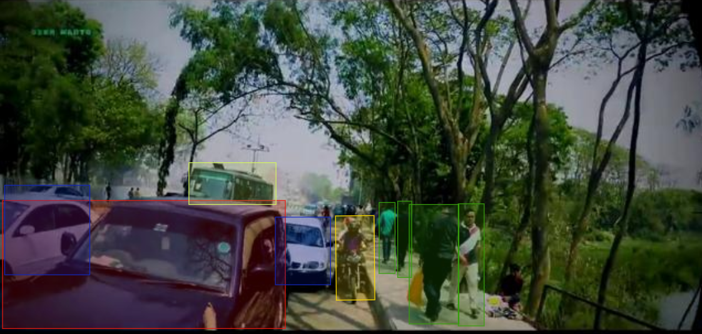

#  Traffic Object Detection using Bounding Boxes + YOLOv8

This project focuses on annotating real-world traffic scenes using **bounding boxes** and training a custom object detection model using **YOLOv8**. The annotations were created in **Label Studio** and exported in **COCO format**, then converted to YOLO format for model training.

##  Annotated Object Classes

The following classes were labeled in the dataset:

-  **Motorbike**
-  **Bicycle**
-  **Bus**
-  **Minibus**, **Sedan**, **Pickup**, **Truck**, **Ambulance**
-  **Tuk Tuk**
-  **Person (Pedestrian)**

##  Why Bounding Boxes?

Bounding box annotation is a widely adopted and efficient method for object detection tasks. It is supported by all modern deep learning models and tools such as YOLO, SSD, and Faster R-CNN.

###  Advantages:
- Fast and lightweight for large datasets
- Supported by most object detection frameworks
- Efficient for real-time applications

###  Limitations:
- Cannot accurately outline irregular shapes
- May overlap in crowded scenes
- Includes extra background pixels

##  Training with YOLOv8

The dataset was used to train a YOLOv8 model using the `ultralytics` Python package. Training was performed using YOLOv8n (nano) for optimal speed and real-time performance.
